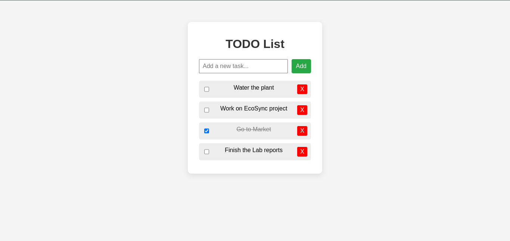

# TODO List Web Application

This is a simple TODO List web application built using **HTML**, **CSS**, and **JavaScript**. The application allows users to add, mark as completed, and delete tasks. It uses **localStorage** to store tasks, so they persist even after the browser is refreshed.

## Features

- **Add Tasks**: Users can add new tasks to the TODO list.
- **Mark Tasks as Done**: Tasks can be marked as completed by checking the checkbox.
- **Delete Tasks**: Users can remove tasks from the list.
- **Persistence**: All tasks are stored in the browser’s localStorage, ensuring the list remains intact after a page refresh.

## Technologies Used

- **HTML**: Used for the basic structure of the application.
- **CSS**: For styling the TODO list interface.
- **JavaScript**: For interactive features like adding, deleting, and toggling tasks.
- **localStorage**: To persist the list of tasks locally in the browser.

## How to Use

1. Clone or download the repository to your local machine.
2. Open `index.html` in your browser to start using the TODO list.
3. You can:
   - Type a task in the input field.
   - Click the "Add" button or press `Enter` to add the task.
   - Mark a task as completed by checking the checkbox.
   - Delete a task by clicking the "X" button next to it.

## Live Demo

You can try the live version of this application at:

[TODO List Live Demo](https://todo-list-html-css-js-self.vercel.app/)

## Repository

The source code for this project is hosted on GitHub. You can access the repository here:

[TODO List Repository](https://github.com/asifikbal09/todo-list-html-css-js)

## Screenshot

Here’s a screenshot of the TODO List in action:



## Installation

To run this project locally:

1. Clone the repository:
   ```bash
   git clone https://github.com/asifikbal09/todo-list-html-css-js

2. Navigate into the project directory:
   ```bash
    cd todo-list-html-css-js 
3. Open index.html in your preferred web browser to start using the application.

## Conclusion

Thank you for checking out this TODO List web application! This project demonstrates how to create a simple, interactive web app using fundamental web technologies such as HTML, CSS, and JavaScript. It's a great starting point for those learning front-end development.

Feel free to explore the code, make improvements, or even contribute. If you found this project useful or interesting, don’t forget to ⭐️ the repository on GitHub!

If you have any questions or suggestions, feel free to open an issue or reach out to me directly.

Happy coding, and good luck with your projects!
